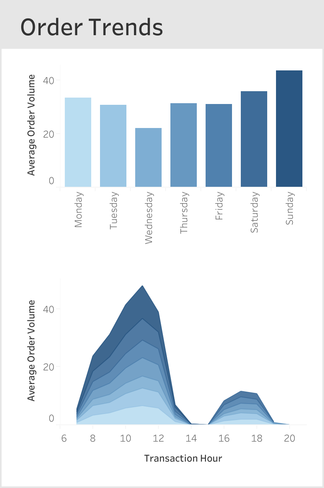
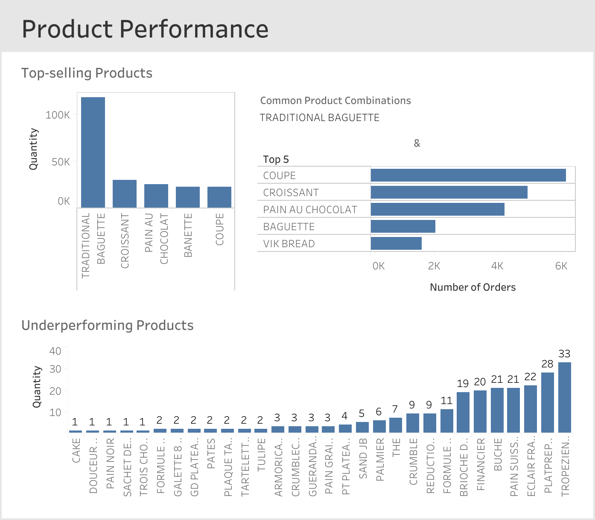

<!-- PROJECT SHIELDS -->
[![LinkedIn][linkedin-shield]][linkedin-url]

<!-- PROJECT TITLE -->
# Le Petit French Bakery Sales Analysis (2021 – 2022)

<!-- DASHBOARD OVERVIEW -->
[![Tableau Dashboard Screenshot][tableau-dashborad-screenshot]][tableau-dashboard-url]

<!-- TABLE OF CONTENTS -->
### Table of Contents
1. [Project Background](#1-project-background)
2. [Data Structure and Preparation](#2-data-structure-and-preparation)
3. [Executive Summary](#3-executive-summary)
4. [Insights Deep-Dive](#4-insights-deep-dive)
5. [Recommendations](#5-recommendations)
6. [Technical Methodology](#6-technical-ethodology)
7. [Caveats and Assumptions ](#7-caveats-and-assumptions)

<!-- PROJECT BACKGROUND -->
## 1. Project Background

Le Petit, a sample local French bakery, sought data-driven insights to drive revenue growth, optimise operations, and improve customer satisfaction. This project **analyses daily sales data from January 2021 to September 2022** to uncover actionable insights and provide strategic recommendations.  

The analysis focuses on three key areas:
- **Sales Trends:** Identifying seasonal and weekly patterns in revenue.
- **Order Trends:** Understanding customer behaviour and peak purchase times.
- **Product Performance:** Evaluating top-selling and underperforming products.  

(<a href="#readme-top">back to top</a>)

<!-- DATA STRUCTURE AND PREPARATION -->
## 2. Data Structure and Preparation

The dataset, sourced from [Kaggle][kaggle-dataset-url], consists of a single table, `transaction_records`, containing **233,973 transaction records**. Below is a breakdown of the table structure:

| Column Name  | Data Type | Description |
| ------------- | ------------- | ------------- |
| `transaction_date` | DATE | The date of the transaction. |
| `transaction_year` | INTEGER | The year of the transaction. |
| `transaction_month` | INTEGER | The month of the transaction. |
| `transaction_day` | INTEGER | The day of the transaction. |
| `transaction_weekday` | STRING | The weekday of the transaction. |
| `transaction_time` | TIME | The time of the transaction. |
| `ticket_number` | INTEGER | A unique identifier for each order. |
| `item_name` | STRING | The name of the product sold. |
| `item_type` | STRING | The type of the product sold. |
| `quantity` | INTEGER | The number of items sold. |
| `unit_price` | FLOAT | The price of a single item. |
| `total_price` | FLOAT | The total price of the transaction. |

 

Before analysis, the dataset underwent rigorous quality control checks using **SQL (BigQuery)**. Key steps included: 
- **Removing Duplicates:** 0.5% of the dataset was identified as duplicates and removed. 
- **Handling Missing Data:** 5 records with missing `item_name` and `unit_price` were excluded. 
- **Formatting Data:** Columns were renamed for clarity, and data types were standardised (e.g., converting `transaction_time` to a time format). 
- **Creating Derived Columns:** New fields, such as `item_type` and `total_price`, were created to facilitate analysis. 

The SQL queries used for data cleaning can be found [here][sql-url].

(<a href="#readme-top">back to top</a>)

<!-- EXECUTIVE SUMMARY -->
## 3. Executive Summary

Le Petit's sales analysis of **233,973 records** across **2021–2022** reveals the following key insights:  
- Total sales reached **$558K** in revenue, with **136K orders** and **359K product units** sold. 
- **Summer months (July and August)** consistently generated the **highest revenue**, with sales peaking at $54K in August 2022. 
- Weekends accounted for 40% of total sales and 35% of average order volume, with **Sundays** being the **busiest day**. 
- **Wednesday** was the **quietest day**, contributing only 9% of total sales and 10% of average order volume. 
- The **busiest hour** was **11 a.m.**, with an average of 48 orders in a week.
- The **top-selling product** was the **Traditional Baguette**, accounting for 33% of the total sales volume.
- More than **30 underperforming products** contributed less than 0.1% of total sales volume. 

Based on these findings, actionable recommendations have been provided to increase revenue, optimize operations, and improve customer satisfaction. 

The entire Tableau interactive dashboard can be accessed [here][tableau-dashboard-url]. 
 

(<a href="#readme-top">back to top</a>)

<!-- INSIGHTS DEEP DIVE -->
## 4. Insights Deep Dive 

### Sales Trends 

**Seasonal Sales Trends:** Sales peaked during the summer months, with July and August generating the highest revenue. In 2021, sales reached **$42K in July and $49K in August. In 2022, sales peaked at $47K in July and $54K in August. 

**Weekly Sales Trends:** Weekends accounted for 40% of total sales, with Sundays generating $126K and Saturdays generating $94K. Wednesdays performed the worst, contributing only 9% of total sales. 

[![Tableau Dashboard Sales Screenshot][tableau-dashborad-sales-screenshot]][tableau-dashboard-url]

### Order Trends 

**Weekly Order Volume:** Sundays had the highest average order volume (43 orders/day), followed by Saturdays (36 orders/day). Wednesdays had the lowest average order volume (22 orders/day). 

**Daily Order Volume:** The busiest hour was 11 a.m., with an average of 48 orders per week. Order volume peaked in the morning (10 a.m. to 12 p.m.) and gradually declined in the afternoon.  

   

### Product Performance 

**Top-Selling Products:** The Traditional Baguette accounted for 33% of total sales volume, followed by Croissant (8%) and Pain au Chocolat (7%). 

**Frequently Purchased Together:** Among 26,808 orders that included at least 1 Traditional Baguette, 23% included Coupe (sliced bread), 18% included Croissant, and 16% included Pain au Chocolat. 

**Underperforming Products:** Out of 128 product types, 33 of them combined contributed less than 0.1% of total sales volume. 

   

(<a href="#readme-top">back to top</a>)

<!-- RECOMMENDATIONS -->
## 5. Recommendations 

Based on the uncovered insights, the following recommendations have been provided: 

### Leverage Seasonal Demand
- **Recommendation:** Introduce refreshing, heat-friendly items during the summer months to capitalize on peak demand. 
- **Estimated Impact:** Increase summer sales revenue. 

### Optimize Product Mix 
- **Recommendation:** Discontinue underperforming products to free up shelf space for high-demand items, including Traditional Baguette, Croissant and Pain au Chocolat. 
- **Estimated Impact:** Drive high-demand items’ sales volume and reduce waste. 

### Streamline Inventory Management 
- **Recommendation:** Adjust production and inventory levels to match demand on busy weekends and quiet weekdays (e.g., Wednesdays). 
- **Estimated Impact:** Avoid stockouts during peak hours and reduce overstock. 

### Enhance Staffing Efficiency 
- **Recommendation:** Schedule additional staff during peak hours (10 a.m. to 12 p.m.) and weekends to handle high customer volume efficiently. 
- **Estimated Impact:** Improve customer satisfaction and reduce wait times. 

### Drive Traffic During Quiet Times 
- **Recommendation:** Run promotions like “Add-On Deals” (e.g., “Add a Croissant for $1 with your Traditional Baguette purchase”) on low-performing weekdays (e.g., Wednesdays) or slower hours (e.g., 4 p.m. to 7 p.m.). 
- **Estimated Impact:** Boost weekday/afternoon customer traffic and encourage customers to try complementary baked goods. 

(<a href="#readme-top">back to top</a>)

<!-- TECHNICAL METHODOLOGY -->
## 6. Technical Methodology 

### Tools Used 
- **SQL (BigQuery):** For data cleaning, transformation, and preparation. [[Queries]][sql-url]
- **Tableau:** For data analysis, visualisation, and dashboard creation. [[Dashboard]][tableau-dashboard-url]

### Data Analysis Process 
- **Data Cleaning:** Removed duplicates, handled missing data, and standardised formats. 
- **Feature Engineering:** Created derived columns (e.g., `item_type`, `total_price`) to enhance analysis. 
- **Exploratory Data Analysis (EDA):** Identified trends, patterns, and anomalies in sales, orders, and product performance. 
- **Visualisation:** Developed interactive dashboards and visualizations (e.g., bar charts and line graphs) to communicate insights effectively. 

(<a href="#readme-top">back to top</a>)

<!-- CAVEATS AND ASSUMPTIONS -->
## 7. Caveats and Assumptions 

**Incomplete Data:** The dataset excludes sales data for October to December 2022, which limits the comprehensiveness of the trend analysis. 

**Missing Product Costs:** Profitability metrics could not be calculated due to the lack of cost data. 

**Assumed Operating Hours:** Based on order volume, it is assumed that Le Petit operates from **7 a.m. to 7 p.m.**, with a lunch break between **2 p.m. and 3 p.m**. 

**No Promotions:** No promotions or discounts were applied during the analysis period. 

**Returned Orders:** Approximately **0.5% of transactions** have negative quantity values, indicating returned orders. These were included in the analysis as their impact was minimal. 

(<a href="#readme-top">back to top</a>)

<!-- MARKDOWN LINKS & IMAGES -->
[linkedin-shield]: https://img.shields.io/badge/linkedin-%230077B5.svg?style=for-the-badge&logo=linkedin&logoColor=white
[linkedin-url]: https://linkedin.com/in/khlleung
[kaggle-dataset-url]: https://www.kaggle.com/datasets/matthieugimbert/french-bakery-daily-sales/data
[sql-url]: sql/data_preparation.sql
[tableau-dashboard-url]: https://public.tableau.com/views/Book1_17384822343040/Dashboard5?:language=en-GB&:sid=&:redirect=auth&:display_count=n&:origin=viz_share_link
[tableau-dashborad-screenshot]: tableau/dashboard.png
[tableau-dashborad-sales-screenshot]: tableau/dashboard_sales.png
